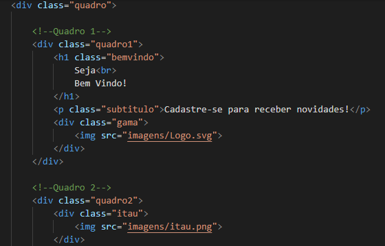
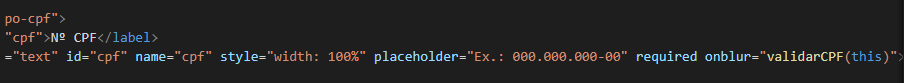
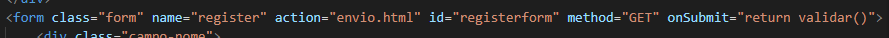
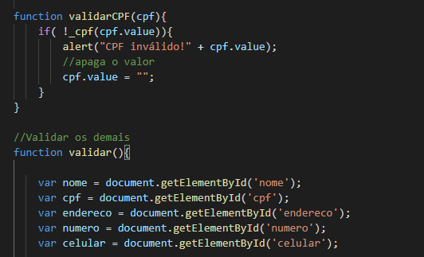
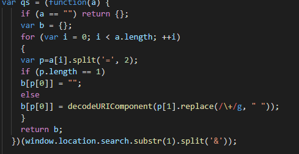

<h1>Desafio - Cadastro Pessoal </h1>

O projeto é um cadastro pessoal. O layout deste projeto foi inspirado pelo site de Gama Academy.

O projeto foi feito em <b>HTML, CSS e Javascript.</b> 

Começando pelo <b>HTML</b>, há dois arquivos com formato html. Um é formulário e outro é envio. Quando formulário for preenchido, outro apresenta dados e diz que foi enviado.

No formulário, foi dividido em 2 quadros no layout para visualizar com satisfação.

Agora no <b>CSS</b>, é único arquivo conectado com 2 arquivos html. Foi responsável por organizar o layout.

E no <b>Javascript</b>, tem 2 arquivos separados. Um é conectar ao arquivo html de formulário para avaliar e validar. E outro é conectar ao arquivo html de envio para apresentar dados preenchidos pelo formulário.

Html faz chamada a função do Javascript para validar CPF e os demais do formulário, em seguida, as 2 imagens serão mostradas:

Chama a função de validar CPF

Chama a função de validar os demais do formulário

o arquivo tem duas funções importantes para validar: CPF e os demais. 

Outro arquivo tem uma função que vai mostrar dados na mensagem.

Com conclusão, o projeto foi realizado com sucesso apresentando os dados preenchidos pelo formulário. 

Pesquisas:

1 - <b>Layout da Gama Academy</b> - https://xpcorp.gama.academy/

2 - <b>Validação de CPF</b> - Aula do módulo de Javascript básico na Gama Academy

3 - <b>Validação dos demais</b> - https://medium.com/@jezmael/como-validar-os-dados-de-um-formul%C3%A1rio-com-javascript-abdc5a5fba67

4 - <b>Mostrar dados na mensagem</b> - https://pt.stackoverflow.com/questions/279539/pegar-apenas-uma-parte-de-uma-url

